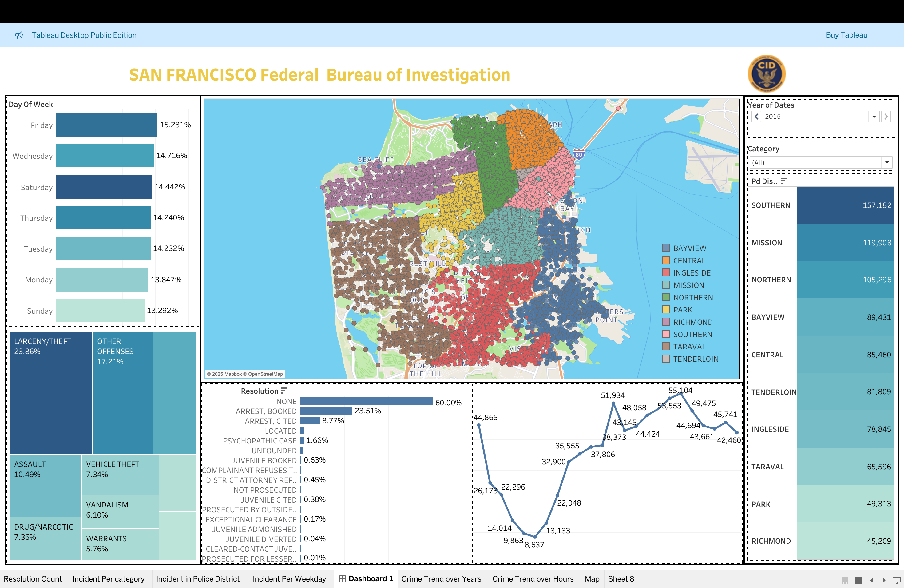

# Crime-Data-Analysis
Tableau dashboard for visualizing San Francisco crime data, identifying regional trends and hot spots with interactive filtering and geo-mapping.

## Key Features

* **Interactive Data Dashboards:** Provides a dynamic and engaging interface for exploring crime statistics.
* **Geo-Visualization:** Integrates interactive maps to display crime incidents geographically, allowing for the identification of crime hot spots and spatial patterns.
* **Region-Wise Crime Analysis:** Enables the examination of crime trends and distributions specific to different regions within Chicago.
* **Dynamic Filtering:** Offers a range of filters (e.g., crime type, date range, community area) to focus on specific subsets of the data.
* **Drill-Down Capabilities:** Allows users to navigate from high-level summaries to detailed information about individual crime incidents.
* **San Francisco Crime Dataset:** Built using the publicly available Chicago Crime Dataset 

